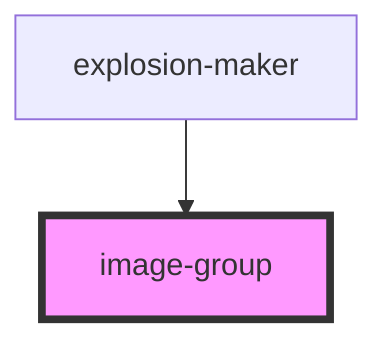

# image-group

<!-- Auto Generated Below -->

## Properties

| Property    | Attribute | Description | Type                         | Default     |
| ----------- | --------- | ----------- | ---------------------------- | ----------- |
| `afterLoad` | --        |             | `(images: NodeList) => void` | `undefined` |

## Dependencies

### Used by

 - [explosion-maker](../explosion-maker)

### Graph

----------------------------------------------

*Built with [StencilJS](https://stenciljs.com/)*
